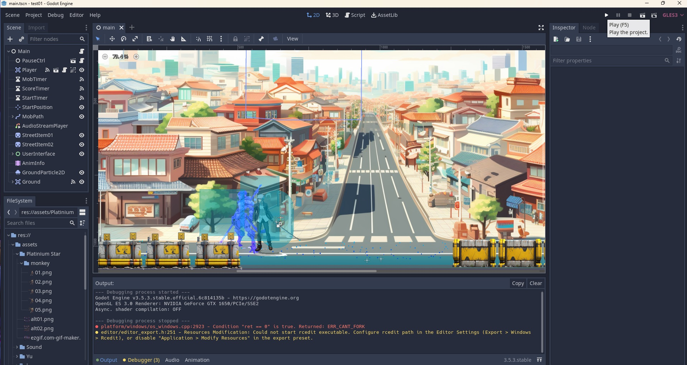
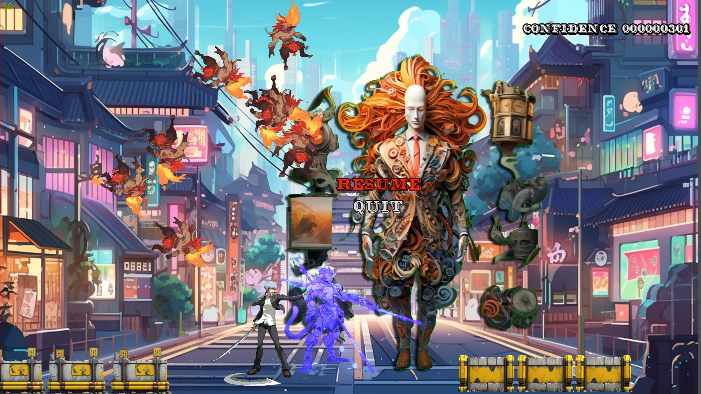

Introduction
============
Simple 2d Beat-em-up game tutorial using Godot Engine (version:v3.2.3 Stable), demo basic action game features:
1. Character Animation 
2. Collision Detection
3. Event Handler

Setup
=====

1. Download Godot Game Development Engine:
https://godotengine.org/download/windows

2. Download Game Source Code:
git clone https://github.com/yockgen/godot-tut01.git

Running Step:
=============
1. Launch Godot
2. Click "Import" button
3. Select "godot-tut01" directory
4. Click "Play" button on top right

5. The tutorial should run

6. For computer keyboard, use direction key to move the character, pressed A to attack enemy (alternatively, you could use joypad to test)

Support
=======
yockgen@gmail.com

Will support on best effort while learning together with question, cheers!
